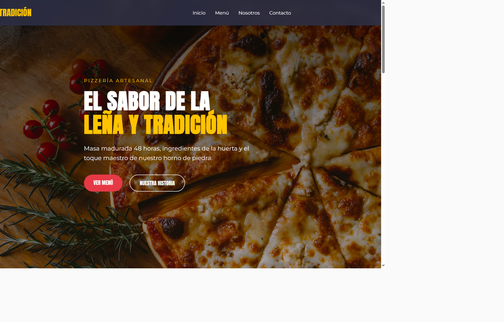

# Tradicion Artesanal

Landing page for an artisan wood-fired pizzeria. Menu carousel, story section, contact block and WhatsApp CTA, built for conversion on mobile and desktop.

[](https://landing-pizzas-artesanales.vercel.app)



**Demo:** https://landing-pizzas-artesanales.vercel.app

## What it includes

- Full-bleed hero with primary and secondary CTAs
- Interactive menu carousel (scroll-snap)
- Story / contact sections and floating WhatsApp button
- Semantic HTML and CSS variables (no UI framework)

## Stack

Astro · HTML · CSS · Vanilla JavaScript · Vercel

## Run locally

Requires Node.js 22+.

```bash
git clone https://github.com/JpSiesquen/Landing-Pizzas-Artesanales.git
cd Landing-Pizzas-Artesanales
npm install
npm run dev
```

Open the URL printed by Astro (usually `http://localhost:4321`).

```bash
npm run build
npm run preview
```

## Author

**Jonathan Siesquen** · [GitHub](https://github.com/JpSiesquen) · [LinkedIn](https://www.linkedin.com/in/jpsiesquen/)
